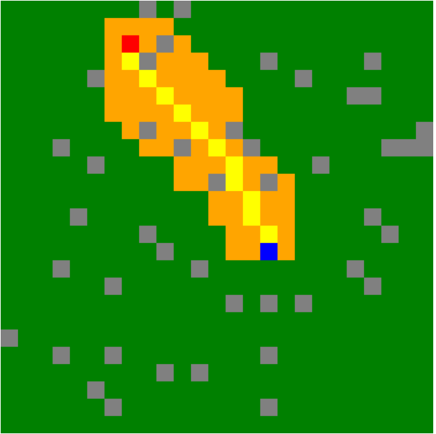
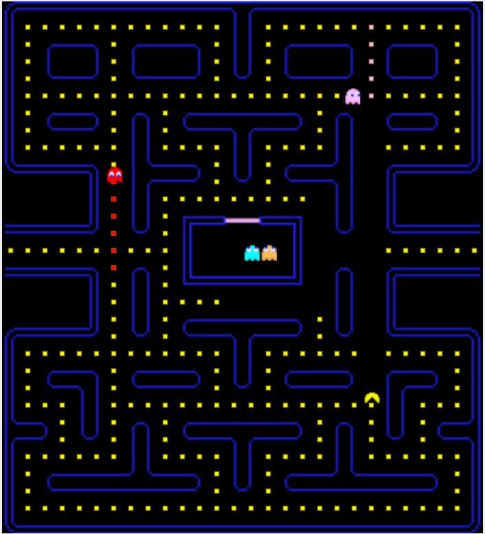
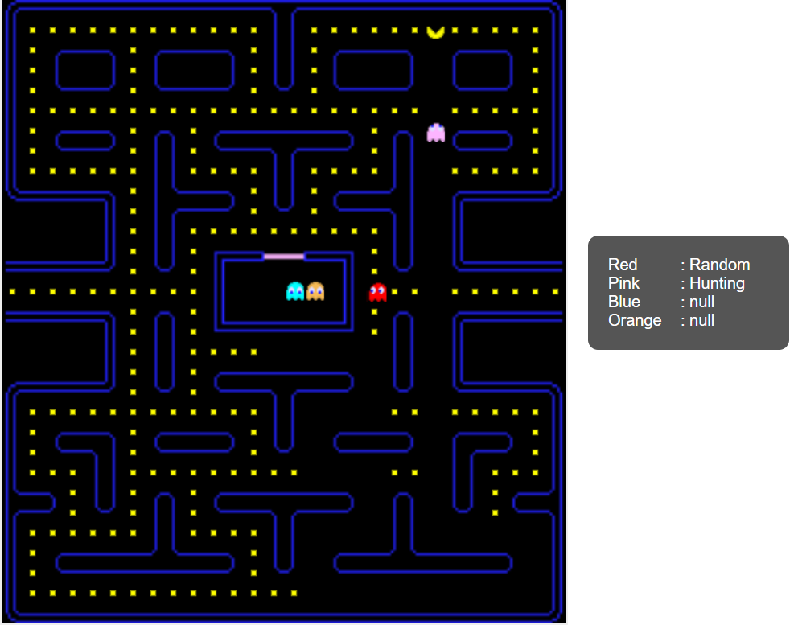

# CSIS260 - Introduction to Artificial Intelligence

Welcome to the CSIS260 repository! This repository houses projects and coursework related to the Introduction to Artificial Intelligence university course. The projects progressively explore different concepts using HTML and JS, covering Finite State Machines (FSM), A* Algorithm, and Fuzzy Logic.

## Project Versions

### 1. FSM Implementation: Traffic Light and Movement

The initial project introduces the concept of Finite State Machines (FSM) by implementing a simple FSM to switch between two scripts: one for simulating a traffic light and another for controlling movement. The project aims to provide a foundational understanding of FSMs and their applications.

**Key Files:**
- `1_FSM/*`: Implementation of simple FSM

### 2. A* Algorithm with Grid Canvas



The second version builds upon the FSM project by implementing the A* algorithm on a canvas divided into a grid. Users can select two blocks, and the algorithm finds the shortest path between them, considering obstacles. This project lays the groundwork for the Pacman implementation in the later stages.

**Key Files:**
- `2_AStar/v2_OOP/*`: Implementation of the A* algorithm on a grid canvas.

### 3. Pacman Game with A* Algorithm



The third version transforms the A* Algorithm project into a fully-fledged Pacman game. The canvas now represents a Pacman map with pellets and ghosts. The A* algorithm is used to make the ghosts chase Pacman, who is controlled by the user. The goal is to collect all pellets while avoiding ghosts.

**Key Files:**
- `2_AStar/v8_Pacman/*`: Pacman game implementation with A* algorithm.

### 4. Fuzzy Logic Ghost Behaviors



In the final version, the project introduces fuzzy logic to enhance ghost behaviors in the Pacman game. The initial code is obfuscated, and different behaviors such as "Hunting," "Defense," "Shy," and "Random" are implemented for the ghosts. Fuzzy logic adds a layer of complexity and adaptability to the ghost AI.

**Key Files:**
- `3_FuzzyLogic/v3/*`: Implementation of fuzzy logic for ghost behaviors.

## Notes

Please note that the code in this repository is old and is not optimal. It serves as a historical record of the projects completed during the CSIS260 course.

## Getting Started

To run any of the projects:

1. Clone the repository to your local machine.
   ```
   git clone https://github.com/rafieissam/csis260.git
   ```
2. Navigate to the specific project directory.
   ```
   cd csis260
   ```
3. Open the `index.html` file of your choice in your browser.
